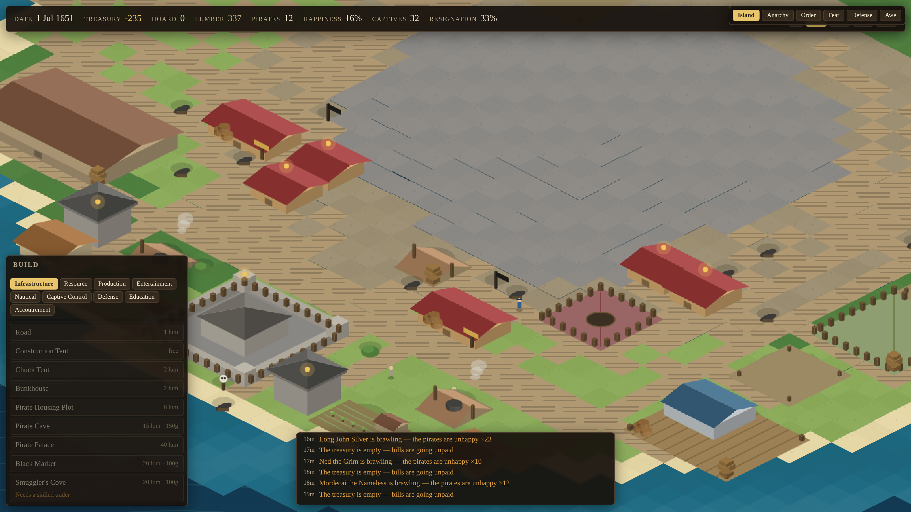
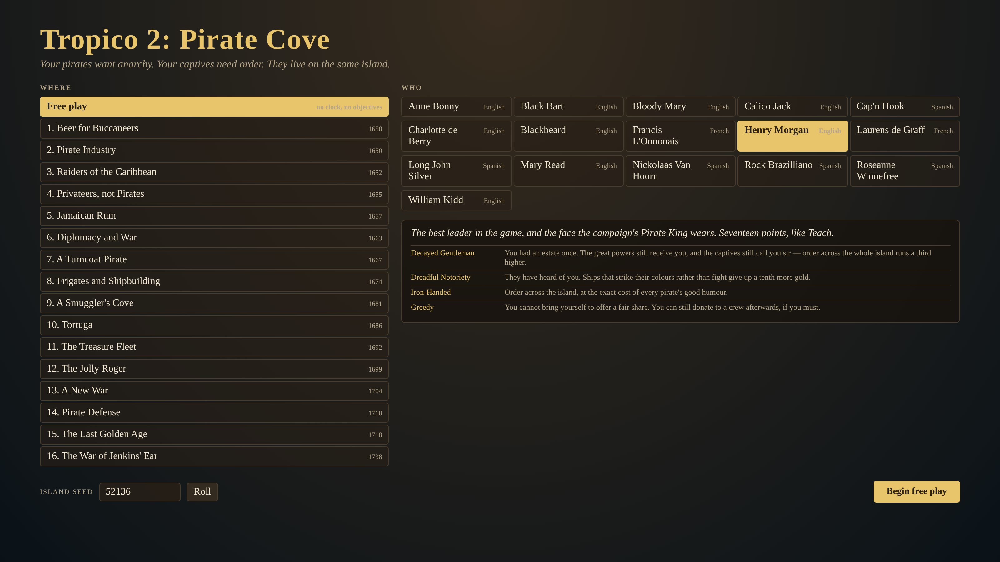
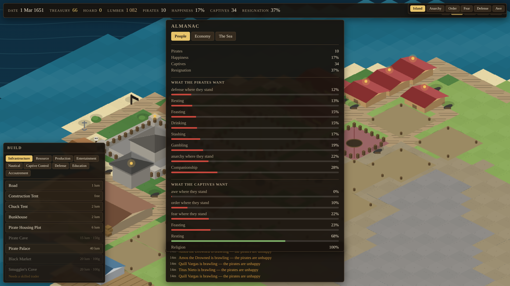
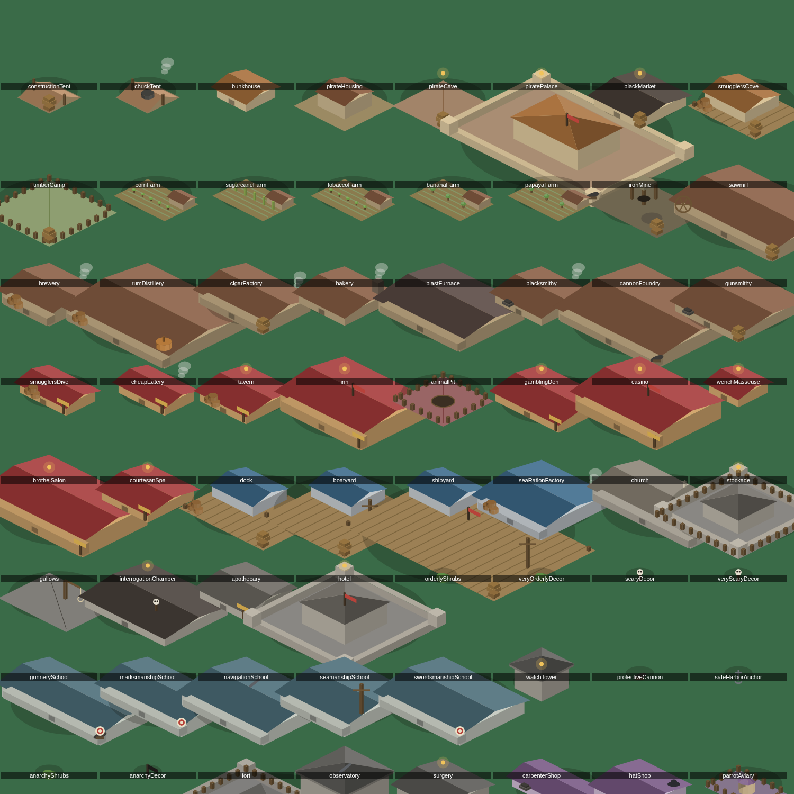

# tropico2

> A pirate haven where the pirates want anarchy and the captives need order,
> and both live on the same island. No install, no assets, no server — the
> whole world is computed from one seed.

[](https://github.com/Vincent-P-essy/tropico2/actions/workflows/ci.yml)
[](https://github.com/Vincent-P-essy/tropico2/actions/workflows/pages.yml)
[](tsconfig.app.json)
[](LICENSE)

A browser reimplementation of **Tropico 2: Pirate Cove** (Frog City Software, 2003) — the odd one out of the Tropico series, and the only city builder whose
core loop is managing two populations that want opposite things.



_This screenshot is generated by the repo itself — `scripts/screenshot.mjs`
boots the real game in headless Chromium, clicks through the start screen,
plays twenty months of it, and captures what it renders._

The game opens by asking the two questions the original opened with — which
water, and which king:



And when the top bar says happiness is seventeen per cent, the almanac says why:



The king is not decoration. A Decayed Gentleman runs a third more order across
the whole island and starts on excellent terms with every power; an Iron-Handed
one buys that order at the exact cost of every pirate's good humour; a king
Tortured by Spain will never make peace with Spain, whatever you do.

## The idea of the game

You are not a dictator; you are the **Pirate King**. The economy runs backwards
from a normal builder: you do not get rich by producing, you get rich by taking.
Gold comes from cruises, and so does labour — the workers on your island are
people your ships took off somebody else's.

Two populations live there, and the whole game is the tension between them:

|                     | Pirates                                                | Captives                                        |
| ------------------- | ------------------------------------------------------ | ----------------------------------------------- |
| aggregate           | **Happiness**                                          | **Resignation**                                 |
| work                | none ashore but Overseer and Guard                     | all of it — building, hauling, farming, serving |
| personal needs      | grub, grog, betting, company, rest, somewhere to stash | food, rest, and a church after two years        |
| environmental needs | **anarchy**, **defense**                               | **order**, **fear**, **awe**                    |
| how they fail you   | brawls, desertion, a captain who fancies your job      | escape → invasion, and open rebellion           |

**Anarchy and order are the same axis pointing opposite ways.** A tavern makes
its neighbourhood free and lawless, which is exactly what a pirate wants and
exactly what makes the captives working next door start eyeing the water. You
cannot satisfy both in one place, so you zone — and zoning is the game.

The two escape hatches are the ones the original gave you, and they are the
whole trick: **pirates cannot see fear**, so a gallows holds a work gang next to
a brothel; **captives cannot see defense**, so a cannon keeps the overseer
content in the middle of an orderly district.

## Playing it

|                    |                                                                           |
| ------------------ | ------------------------------------------------------------------------- |
| Pan                | drag, or arrow keys                                                       |
| Zoom               | wheel                                                                     |
| Build              | pick from the menu, click to place, right-click to cancel                 |
| Inspect            | click a building or a person                                              |
| See the auras      | the overlay buttons, top right — this is how you find your zoning problem |
| Assign a worker    | click a building, then pick from its list of who could do the job         |
| The fleet          | `F`                                                                       |
| Edicts             | `E`                                                                       |
| The almanac        | `A` — why the numbers in the top bar are what they are                    |
| Turn a building    | `R` before placing it                                                     |
| Speed              | `space` to pause, `1`–`4`                                                 |
| Save               | `Ctrl`/`Cmd` + `S` — and the start screen offers the way back             |
| A specific island  | add `?seed=1650` to the URL                                               |
| A campaign episode | add `?episode=1` … `?episode=16`                                          |

The first thing to understand is that **lumber is money**. Almost nothing costs
gold; nearly everything costs lumber, so the timber camp → sawmill chain gates
how fast you can grow. The second is that **nothing moves itself**: a brewery
with corn in the fields and no hauler to fetch it produces nothing at all.

## What is faithful, and what is not

The catalogue in [`src/data/`](src/data) is the original's content, reconstructed
from the game's own data rather than reinvented:

- **65 buildings** with their real footprints, gold and lumber costs, upkeep,
  staffing, recipes and aura strengths. An aura written `(34:3)` in the original
  is `strength: 34, radius: 3` here.
- **6 ship classes** — Snow, Schooner, Sloop, Brigantine, Frigate, Galleon —
  with their published speed, crew, rations and armament.
- **16 captains** with their stat lines. By leadership + courage + notoriety the
  best three are Edward Teach, Henry Morgan and Laurens de Graff, at 17, exactly
  as in the original.
- **10 backgrounds, 17 qualities, 11 flaws** for the Pirate King, with the
  island-wide effects they actually had.
- **~35 edicts** in the original's five categories.
- **16 campaign episodes**, 1650–1747, with their start dates, starting
  resources, objectives and bronze/silver/gold time thresholds.

[`src/data/fidelity.test.ts`](src/data/fidelity.test.ts) pins all of it: the
ship table, every captain's stat line, every published aura strength and radius,
every footprint, the Black Market and Smuggler's Cove price lists, the rank
thresholds, and all sixteen episodes' dates and deadlines. It is separate from
the coherence tests on purpose — it is the thing to run after any balance work
to be sure a tuning pass has not quietly rewritten the game into something else.

Not reproduced: the original's art and audio, and its per-tick balance curves,
which were never published. The numbers in
[`src/data/balance.ts`](src/data/balance.ts) are tuned to reproduce its
_behaviour_ — a chuck tent feeds about thirty captives, a captive who cannot
reach food starves in a few weeks — and every one of them is in that one file.

### Four things the original got wrong, fixed

It was reviewed as a good idea with sharp edges. These are corrected, each in a
way that leaves the mechanic intact:

1. **You choose who works where.** The original gave you no say, so a tavern
   could sit dry for a year because the game had quietly decided its hauler was
   better used on a farm. Click a building and it lists who works there, who
   could, and lets you swap them by name.
2. **Broken supply chains say so.** Every building answers "why is this idle?"
   with the actual cause — no hauler, no input, no skilled worker — instead of
   silently producing nothing.
3. **Randomness is bounded.** No event can put a scenario into an unwinnable
   state, and no single roll destroys a run.
4. **No arbitrary campaign locks.** Episodes constrain by resources and time,
   not by hiding the buildings you need to keep anyone happy.

## How it is built

```
core/    seeded RNG, tile grid, typed-array fields, isometric projection, A*
data/    the catalogue: buildings, goods, jobs, ships, captains, traits, edicts,
         scenarios, and every tuning constant in the game
sim/     the simulation — pure TypeScript, no DOM, deterministic, serialisable
render/  canvas drawing; reads the simulation, never mutates it
ui/      DOM panels; emit intent, never touch state directly
app/     the only file that knows about the clock, the mouse and the browser
```

**The simulation is the product.** `sim/` is plain data and free functions:
`tick(state)` advances one game-hour, and nothing below `app/` calls
`Math.random` or `Date.now`. That buys determinism (same seed and same commands
give a bit-identical world), trivial saves, and a test suite that runs the whole
game with no browser and no mocks.

Every sprite — terrain, all 65 buildings, people, ships — is drawn in code into
an offscreen canvas at boot. The game loads no images at all; the only PNGs in
the repository are the screenshots in `docs/`, and those are output, not input.

<p align="center"></p>

_Every building in the game. `node scripts/spritesheet.mjs` renders this sheet
straight from the sprite cache — it is how the art gets reviewed, and how a bug
that was painting a third of the island black got caught._

## Running it

```bash
npm install
npm run dev          # play it at localhost:5173
npm test             # 380 tests, no browser needed
npm run typecheck
npm run lint
npm run screenshot   # boots the real game headless and photographs it
npm run resume       # plays, saves, reloads the page, and goes back to it
```

`npm run screenshot` doubles as the end-to-end test: it plays twenty months in
headless Chromium and fails if the world did not advance, if the canvas drew
nothing, or if anything reached the console. `npm run resume` covers the one
thing unit tests cannot, because it spans two page loads — that a saved haven
can be got back out again through the screen a player actually uses.

## Notes from building it

Nine bugs during development each killed the whole island, or quietly removed a
whole part of it, and every one is now
locked down by a test. They are worth listing because they were all the same
kind of mistake — a rule that was locally reasonable and globally fatal:

- A worker inside any building bigger than 2×2 was **walled in**: every
  neighbour of the tile he stood on belonged to his own workplace, so A\* found
  no route out and he never left.
- Buildings' occupant lists **leaked**, so after a month every building believed
  it was full and turned everyone away.
- A cook whose kitchen was also where he ate got put back to work on arrival and
  **starved inside his own kitchen**. Walking now carries an explicit intent.
- A hungry worker abandoned his post **even when there was nowhere to eat**,
  which stopped the kitchen that would have fed him.
- The opening layout searched outward for anywhere a building would fit, and so
  produced buildings **nothing could reach**. Whoever lived there had those needs
  pinned at zero and the island quietly emptied over a few years. Roads now go
  down first, in a connected grid, and a building may only take a site fronting
  one — and since a later neighbour can still close the last door of an earlier
  building, every placement is checked afterwards and taken back up if anybody
  lost their way out.
- Housing was laid at fixed offsets from the centre, which on a lopsided island
  is mostly sea: **eleven of twelve pirates had no plot**, and so had resting and
  stashing at zero from the first hour. Frontage is now made rather than found —
  the road is routed out to a site before anything is built on it.
- The powers never came. Relations, forts, guards and the patron edict all led
  to an invasion that **nothing ever called**, so three nations could spend a
  decade at war with the haven without one sail on the horizon.
- The game could **save but not load**. Nothing was wired to the way back, and
  no unit test could have caught it: it takes two page loads to see.
- Staffing went straight down the priority list, filling each building to its
  last man before starting the next, so **every tavern, pit and masseuse stood
  empty** behind the counter while the farms took every pair of hands. Sharing
  the hands out evenly instead makes priority meaningless and starves a hungry
  island. Now it is a priority band at a time, and inside a band everybody gets
  their first worker before anybody gets a second.

And one piece of arithmetic worth writing down: a starting island of dives and
bare plots caps near **thirty per cent** pirate happiness, because that is what
its buildings can offer. Any unrest threshold above that puts every new game in
permanent crisis through no fault of the player's. Ranks, taverns, inns and
casinos are how the number climbs — and all of them are paid for by going to sea.

## Licence

MIT. _Tropico 2: Pirate Cove_ is the work of Frog City Software and PopTop
Software; this is an independent reimplementation of its systems, written from
published descriptions of how the game worked, and contains none of its assets.
